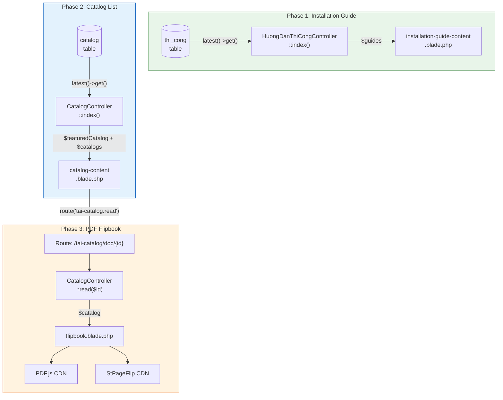
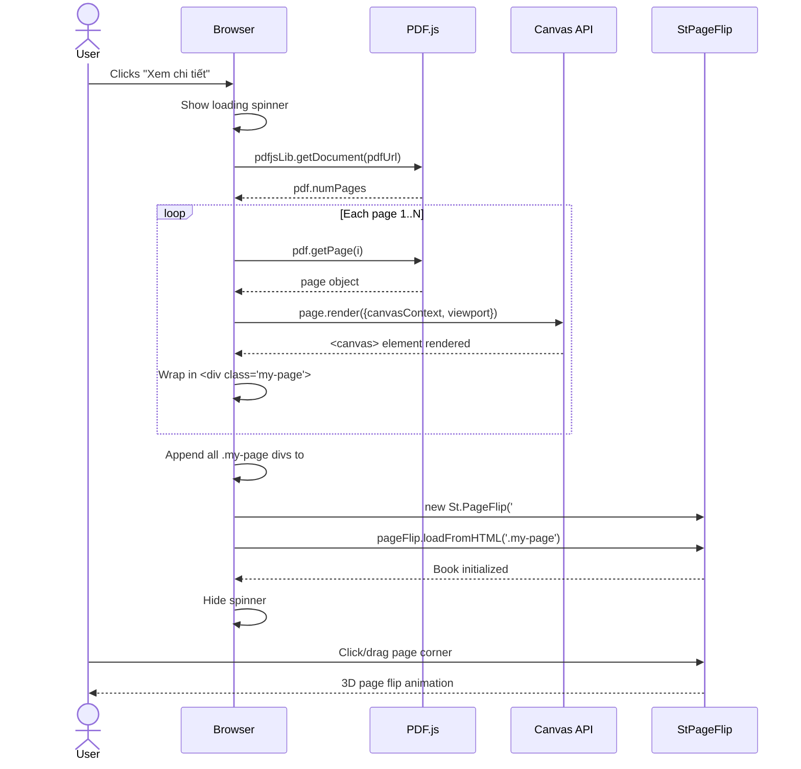

# Diagram: Dynamic Customer Service Pages Architecture

## ASCII Version

```
┌─────────────────────────────────────────────────────────┐
│                    DATABASE LAYER                        │
│                                                         │
│  ┌─────────────────┐       ┌──────────────────┐         │
│  │    thi_cong     │       │     catalog      │         │
│  │─────────────────│       │──────────────────│         │
│  │ thi_cong (PK)   │       │ catalog_id (PK)  │         │
│  │ tieu_de         │       │ tieu_de          │         │
│  │ anh             │       │ anh_dai_dien     │         │
│  │ link_youtube    │       │ file (PDF path)  │         │
│  └────────┬────────┘       └────────┬─────────┘         │
└───────────┼─────────────────────────┼───────────────────┘
            │                         │
┌───────────┼─────────────────────────┼───────────────────┐
│           │     CONTROLLER LAYER     │                   │
│           │                         │                   │
│  ┌────────┴───────────────────┐ ┌──┴──────────────────┐ │
│  │ HuongDanThiCongController  │ │ CatalogController   │ │
│  │────────────────────────────│ │─────────────────────│ │
│  │ index() -> $guides         │ │ index() -> featured │ │
│  │                            │ │         -> grid     │ │
│  │                            │ │ read($id) -> PDF    │ │
│  └────────┬───────────────────┘ └──┬──────┬───────────┘ │
└───────────┼─────────────────────────┼──────┼─────────────┘
            │                         │      │
┌───────────┼─────────────────────────┼──────┼─────────────┐
│           │      VIEW LAYER          │      │             │
│           │                         │      │             │
│  ┌────────┴──────────────────┐ ┌────┴──────┴──────────┐ │
│  │ installation-guide-       │ │ catalog-content      │ │
│  │   content.blade.php       │ │   .blade.php         │ │
│  │───────────────────────────│ │──────────────────────│ │
│  │ @foreach($guides)         │ │ @if($featured)       │ │
│  │   2-col zigzag layout     │ │ @foreach($catalogs)  │ │
│  │   title + img + youtube   │ │   grid items         │ │
│  └───────────────────────────┘ └──────────────────────┘ │
│                                                         │
│                        ┌──────────────────────┐         │
│                        │ flipbook.blade.php   │         │
│                        │──────────────────────│         │
│                        │ Standalone HTML page │         │
│                        │ PDF.js + StPageFlip  │         │
│                        │ Fullscreen dark bg   │         │
│                        └──────────────────────┘         │
└─────────────────────────────────────────────────────────┘
```

## Mermaid Version — Phase Architecture



## Mermaid Version — Flipbook Rendering Pipeline



## Data Flow Summary

| Phase | Controller Method | Model | View | Output |
|-------|-------------------|-------|------|--------|
| 1 | `index()` | `ThiCong` | `installation-guide-content` | Zigzag grid rows |
| 2 | `index()` | `Catalog` | `catalog-content` | Featured + grid |
| 3 | `read($id)` | `Catalog` | `flipbook` | Fullscreen PDF reader |
